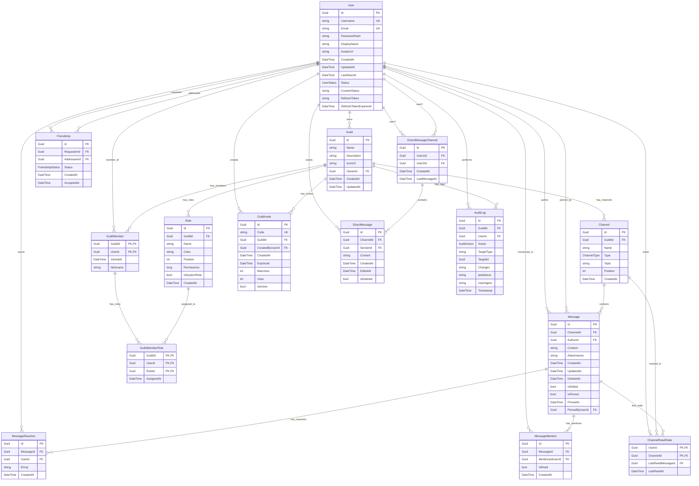

# Chord Database ER Diagram

> **Purpose:** Visual representation of the Chord database schema and entity relationships.

## Entity Relationship Diagram

## Entity Summary

| Entity | Description | Key Relationships |
|--------|-------------|-------------------|
| **User** | Authentication, profile (username, email, avatar, status) | Owns Guilds, sends Messages, has Friendships |
| **Guild** | Discord-like servers (name, icon, owner) | Has Members, Channels, Roles, Invites |
| **GuildMember** | Guild membership (user, guild, nickname) | Links User to Guild, has Roles |
| **Channel** | Text/Voice/Announcement channels in guilds | Belongs to Guild, contains Messages |
| **Message** | Chat messages with attachments | Belongs to Channel, has Reactions/Mentions |
| **MessageReaction** | Emoji reactions on messages | Links User to Message |
| **MessageMention** | @mentions tracking with read status | Links User to Message |
| **ChannelReadState** | Unread message tracking | Links User to Channel |
| **Role** | Guild roles with permissions | Belongs to Guild, assigned to Members |
| **GuildMemberRole** | Member role assignments (join table) | Links GuildMember to Role |
| **GuildInvite** | Invite links | Belongs to Guild, created by User |
| **Friendship** | Friend relationships (Pending, Accepted, Blocked) | Links two Users |
| **DirectMessageChannel** | DM channels between users | Links two Users (User1Id < User2Id) |
| **DirectMessage** | DM messages with soft delete | Belongs to DirectMessageChannel |
| **AuditLog** | Audit trail for guild actions (owner-only access) | Belongs to Guild, performed by User |

## Key Constraints

- **Composite Keys:**
  - `GuildMember`: (GuildId, UserId)
  - `GuildMemberRole`: (GuildId, UserId, RoleId)
  - `ChannelReadState`: (UserId, ChannelId)

- **Unique Constraints:**
  - `User.Username` - Unique
  - `User.Email` - Unique
  - `GuildInvite.Code` - Unique (8 characters)
  - `Role.Name` - Unique within Guild
  - `Friendship` - Unique (RequesterId, AddresseeId)
  - `DirectMessageChannel` - Unique (User1Id, User2Id) where User1Id < User2Id
  - `MessageReaction` - Unique (MessageId, UserId, Emoji)
  - `MessageMention` - Unique (MessageId, MentionedUserId)

- **Cascade Delete Rules:**
  - Guild → Channels, Members, Roles, Invites, AuditLogs (Cascade)
  - Channel → Messages, ChannelReadStates (Cascade)
  - Message → Reactions, Mentions (Cascade)
  - DirectMessageChannel → DirectMessages (Cascade)
  - GuildMember → GuildMemberRoles (Cascade)
  - User → Messages, Reactions, etc. (Restrict - cannot delete user with data)

## Notes

- All timestamps use UTC (`GETUTCDATE()` default)
- Soft delete is used for Messages (`DeletedAt`) and DirectMessages (`IsDeleted`)
- `DirectMessageChannel` enforces User1Id < User2Id to ensure uniqueness
- `AuditLog.GuildId` is nullable for global actions
- `Role.Position` hierarchy: 0 = Owner, 1-998 = Custom, 999 = General
- `Channel.Position` is scoped by Type (Text/Voice/Announcement have separate position sequences)
